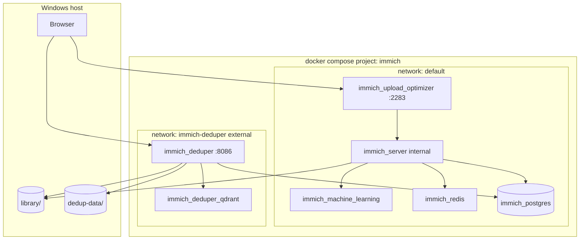

# Architecture

## Overview



## Service dependencies

```
redis ──┐
        ├──► immich-server (after healthy)
database ─┘

qdrant ──► immich-deduper
database ──► immich-deduper (after healthy)
```

## Volume mounts

| Service | Host | Container | Mode |
|---------|------|-----------|------|
| immich-server | `${UPLOAD_LOCATION}` | `/data` | rw |
| immich-server | `${EXTERNAL_LIBRARY_PATH}` | `/photos-import` | ro |
| immich-deduper | `${UPLOAD_LOCATION}` | `/immich` | ro |
| immich-deduper | `${DEDUP_DATA}` | `/app/data` | rw |
| database | volume `pgdata` | `/var/lib/postgresql/data` | rw |

## Two duplicate workflows

| Tool | URL | Mechanism |
|------|-----|-----------|
| **Immich built-in** | `/utilities/duplicates` | Smart search / CLIP embeddings via Immich ML |
| **immich-deduper** | http://localhost:8086 | ResNet152 + Qdrant; direct Postgres + file access |

Both can coexist; deduper is heavier but often better for large visual similarity sets.

## Configuration source of truth

| Setting type | Where |
|--------------|--------|
| Infra (ports, images, volumes) | `docker-compose.yml` + `.env` |
| Immich jobs, ffmpeg, features | **Immich Admin UI** only |
| Deduper tuning | Deduper UI + `.env` (`PSQL_*`, `QDRANT_URL`) |
| Historical Immich export | `setup/immich-config.json` (not loaded) |
