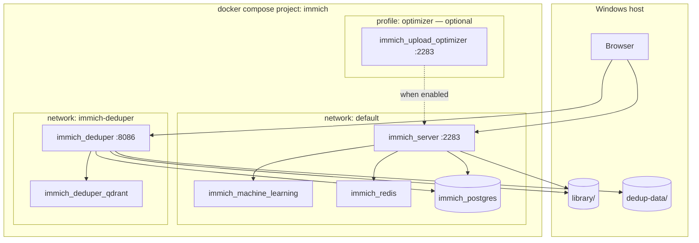

# Architecture

## Overview



## Compose modules (reusable)

Root `docker-compose.yml` only `include`s modules — like composing UI from building blocks:

| Module | File | When loaded |
|--------|------|-------------|
| **Base** | `docker-compose.yml` | Always — server, ML, Redis, Postgres |
| **Deduper** | `docker-compose.deduper.yml` | Included by default |
| **Upload optimizer** | `docker-compose.optimizer.yml` | `--profile optimizer` |

Add-ons sit next to `docker-compose.yml` so `.env` paths (`./library`, `./dedup-data`) resolve correctly.

## Service dependencies

```
redis ──┐
        ├──► immich-server (after healthy)
database ─┘

qdrant ──► immich-deduper
database ──► immich-deduper (after healthy)
```

## Volume mounts

| Service | Host | Container | Mode |
|---------|------|-----------|------|
| immich-server | `${UPLOAD_LOCATION}` | `/data` | rw |
| immich-server | `${EXTERNAL_LIBRARY_PATH}` | `/photos-import` | ro |
| immich-deduper | `${UPLOAD_LOCATION}` | `/immich` | ro |
| immich-deduper | `${DEDUP_DATA}` | `/app/data` | rw |
| database | `${DB_DATA_LOCATION}` | `/var/lib/postgresql/data` | rw |
| immich-machine-learning | `${MODEL_CACHE_LOCATION}` | `/cache` | rw |
| redis | `${REDIS_DATA_LOCATION}` | `/data` | rw |

## Two duplicate workflows

| Tool | URL | Mechanism |
|------|-----|-----------|
| **Immich built-in** | `/utilities/duplicates` | Smart search / CLIP via Immich ML |
| **immich-deduper** | http://localhost:8086 | ResNet152 + Qdrant; Postgres + files |

## Configuration source of truth

| Setting type | Where |
|--------------|--------|
| Infra (ports, images, volumes) | `compose/` + `.env` |
| Immich jobs, ffmpeg, features | **Admin UI** only |
| Deduper tuning | Deduper UI + `.env` (`PSQL_*`, `QDRANT_URL`) |
| Job caps reference | `setup/safe-job-settings.json` → apply in Admin UI |
| Historical export | `setup/immich-config.json` (not loaded) |

## ML

CPU-only: `ghcr.io/immich-app/immich-machine-learning:release`. No GPU/ROCm on this stack.
