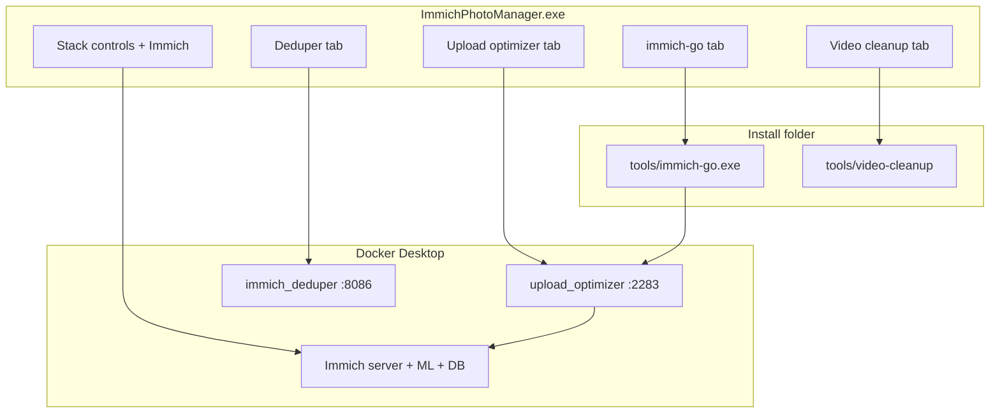

# Immich Photo Manager — suite guide

**Immich Photo Manager** is an unofficial Windows distribution. It does not replace upstream projects — it installs and coordinates them.

## Architecture



| Piece | Runs as | Independent upstream |
|-------|---------|----------------------|
| Immich library | Docker | https://immich.app |
| Upload optimizer | Docker :2283 | https://github.com/miguelangel-nubla/immich-upload-optimizer (+ local patch) |
| immich-deduper | Docker :8086 | https://github.com/RazgrizHsu/immich-deduper |
| immich-go | Windows `.exe` in `tools\` | https://github.com/simulot/immich-go |
| Video cleanup | PowerShell + HandBrake CLI | https://handbrake.fr |

## Install with setup.exe

1. Install [Docker Desktop](https://www.docker.com/products/docker-desktop/) (WSL2).
2. Run `ImmichPhotoManager-x.y.z-setup.exe` from [Releases](https://github.com/abdullahmiraz/immich-photo-manager/releases). Verify SHA256 from `SHA256SUMS.txt`.
3. Default install folder: `%LOCALAPPDATA%\ImmichPhotoManager`.
4. When setup finishes, launch **Immich Photo Manager** from the Start Menu.

The installer:

- Copies the Compose stack and tools
- Generates random database passwords in `.env`
- Downloads **immich-go** (pinned version)
- Optionally pulls images and runs `docker compose up -d`

## Manager — four tabs

| Tab | What you do |
|-----|-------------|
| **Deduper** | Open http://localhost:8086, view container status and logs |
| **Upload optimizer** | Open http://localhost:2283 (uploads go through optimizer when enabled) |
| **immich-go** | Bulk import; open tools folder or PowerShell help |
| **Video cleanup** | Run `optimize.ps1`; install HandBrake CLI separately |

**Header** (all tabs): Start / stop / update the Docker stack, open Immich, refresh status.

Install path is stored in `%LOCALAPPDATA%\ImmichPhotoManager\install.json`.

## Manual install (no setup.exe)

See [RECIPES.md — First-time setup](RECIPES.md#first-time-setup). Run the manager from a dev build:

```powershell
dotnet run --project manager\ImmichPhotoManager\ImmichPhotoManager.csproj
```

The manager finds `docker-compose.yml` in a parent directory if `install.json` is missing.

## Security

See [SECURITY.md](../SECURITY.md). Summary:

- Strong passwords generated on install
- Do not expose Postgres to the internet
- Use HTTPS reverse proxy for remote access
- Update with `docker compose pull && docker compose up -d` only

## Uninstall

Windows **Settings → Apps** removes shortcuts and program files. **Photos remain** in `{install}\library\` unless you delete that folder. Optional: stop the stack when the uninstaller asks.

## Maintainer

- Build installer: [installer/README.md](../installer/README.md)
- Publish optimizer image: [scripts/publish-optimizer-image.ps1](../scripts/publish-optimizer-image.ps1)
